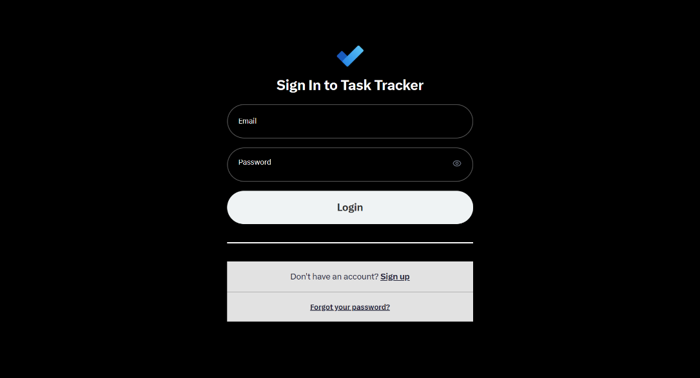
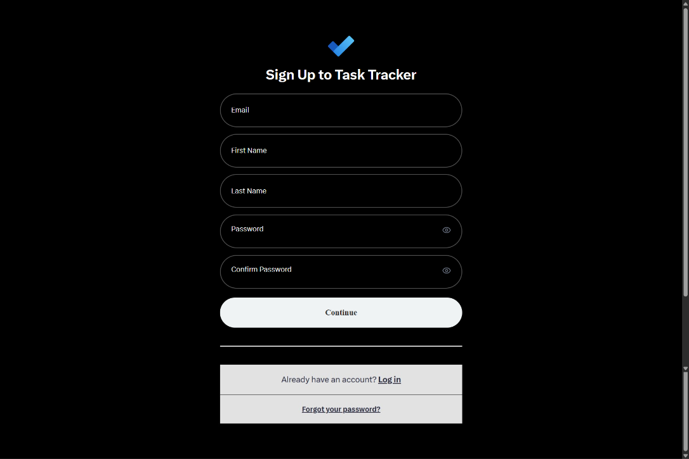
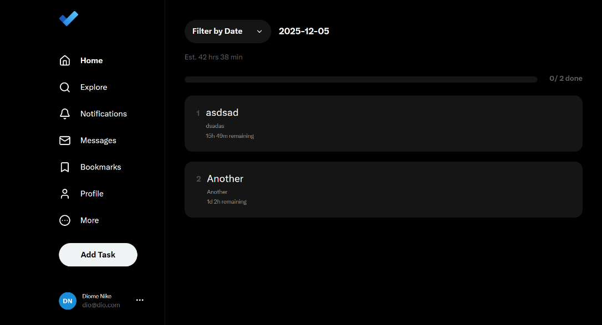
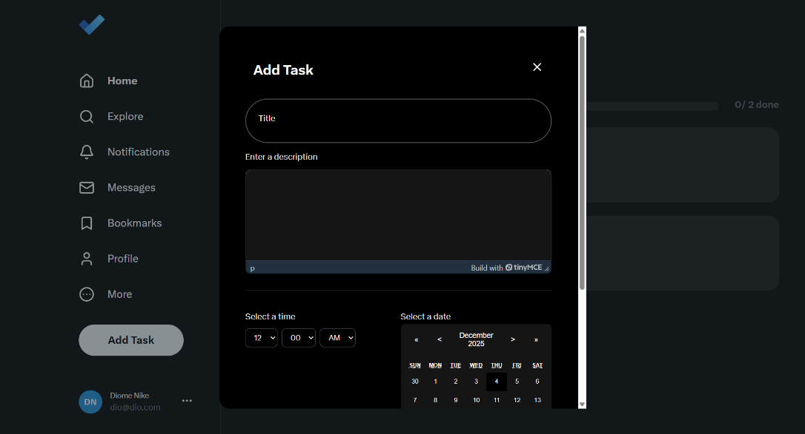
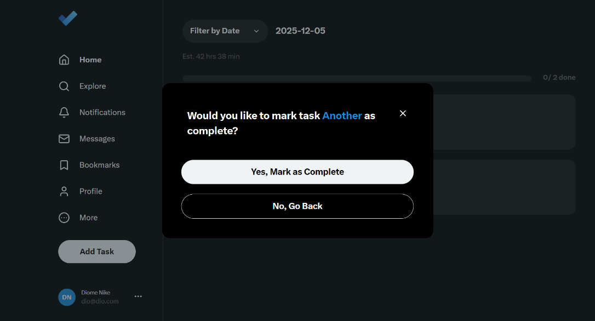
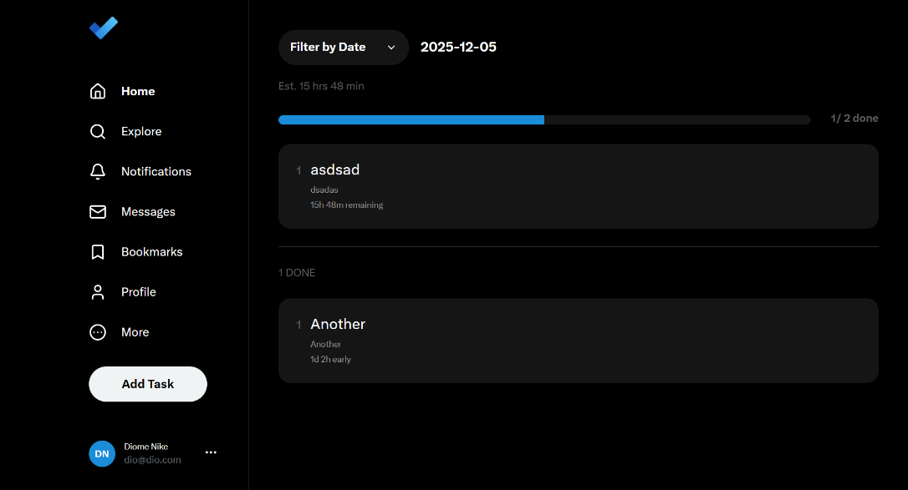
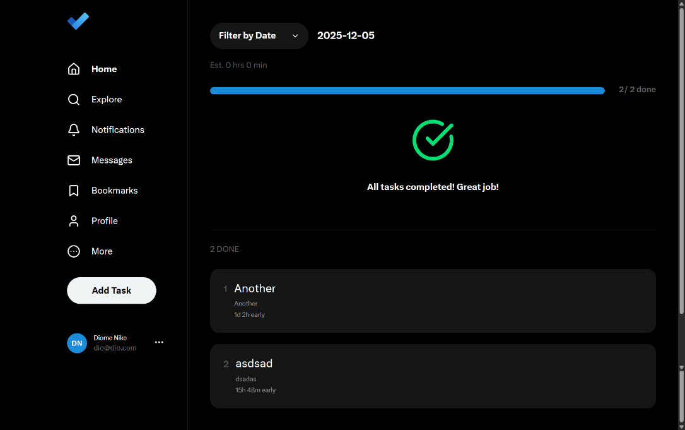

## Screenshots

### Screen 1



### Screen 2



### Screen 3



### Screen 4



### Screen 5



### Screen 6



### Screen 7



# Next.js Project

This is a Next.js project bootstrapped with `create-next-app`.

## Getting Started

Follow these steps to run the project locally:

### 1. Install Dependencies

```bash
npm install
```

# 2. Configure Environment Variables

Create a .env file in the root of the frontend (FE) folder with the following content:

```bash
NEXT_PUBLIC_TOKEN="app_token"
NEXT_PUBLIC_API_URL="http://localhost:5001/api"
NEXT_PUBLIC_TINYMCE_API_KEY="15t4k1wg1iqk9lgyj4v0uaj94g9zwx3fxau7hj15km2vvcja"
```

# 3. Build the Project

```bash
npm run build
```

# 4. Start the Production Server

```
npm run start
```
